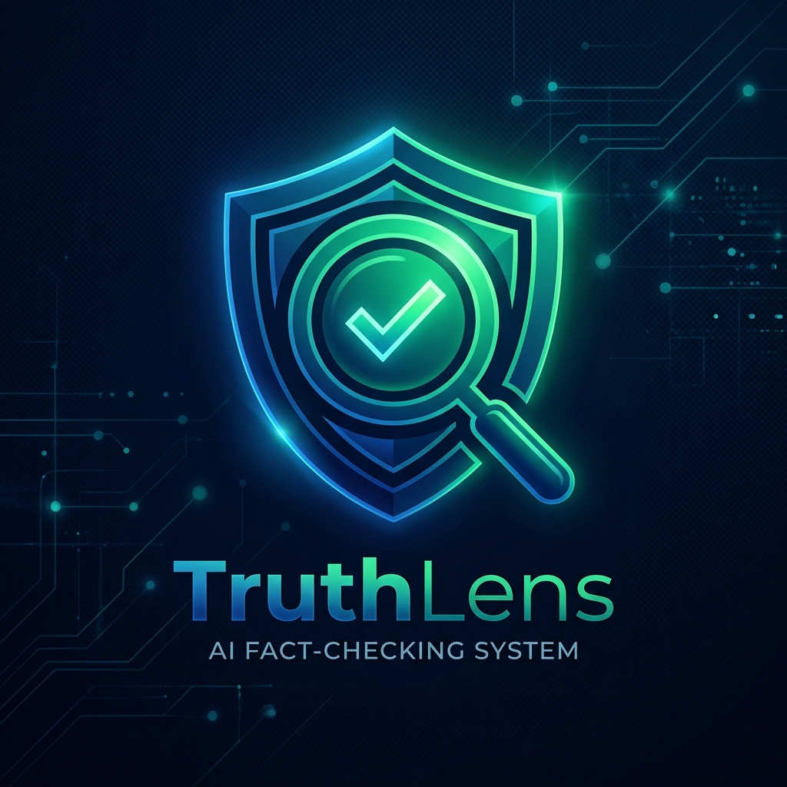
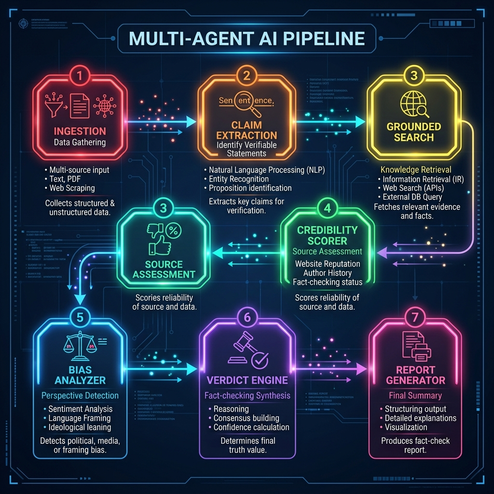
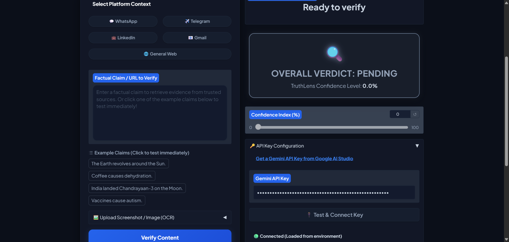
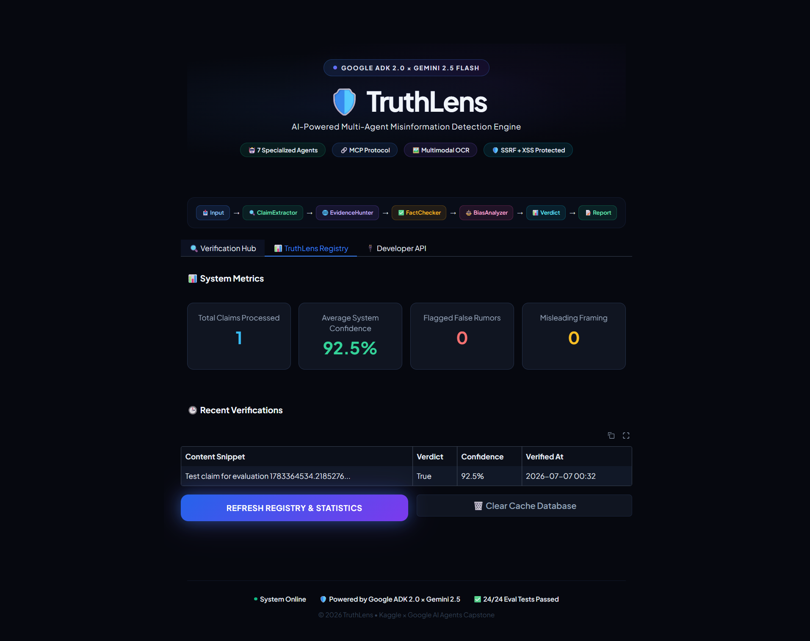
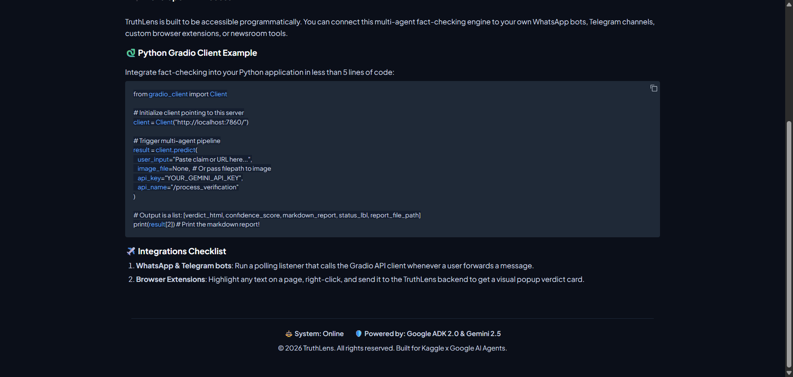

# 🛡️ TruthLens: Advanced Multi-Agent Misinformation Detection System

<p align="center">
  
</p>

### **Kaggle x Google AI Agents Capstone Submission**
*   **Permanent Cloud Deployment:** [Hugging Face Space](https://huggingface.co/spaces/Rohith-Shimori/TruthLens-AI-Agent)
*   **Local Gradio Tunnel Demo:** https://719d9f67316656d5e2.gradio.live
*   **Kaggle Writeup Documentation:** [kaggle_writeup.md](docs/kaggle_writeup.md)

TruthLens is an enterprise-grade, multi-agent fact-checking and misinformation detection system. It is designed to help users quickly verify claims spreading across social media (WhatsApp, Telegram, Twitter, LinkedIn) by orchestrating a pipeline of specialized AI agents.

Built using the **Google Agent Development Kit (ADK) 2.0**, **Gemini 2.5 Flash**, **Model Context Protocol (MCP)**, and **Gradio**, TruthLens is a robust, secure, and highly auditable verification engine.

---

## 🏗️ System Architecture

TruthLens employs a sequential multi-agent graph containing 7 specialized agents:

<p align="center">
  
</p>

---

## 📸 Screenshots Gallery

<p align="center">
  <b>Verification Hub Workspace</b><br>
  <br><br>
  <b>TruthLens Registry & Statistics Cache</b><br>
  <br><br>
  <b>Developer API Integrations</b><br>
  
</p>

---

## ✨ Key Features & Course Concepts Demonstrated

1. **Multi-Agent Orchestration (ADK 2.0)**: Orchestrates 7 highly focused, specialized agents using a linear graph workflow via `google.adk.Workflow`.
2. **Model Context Protocol (MCP)**: Implements a custom MCP Fact-Checking server (`mcp_server.py`) exposing core evidence tools, credibility checks, and bias analysis.
3. **Smart Session Memory**: Automatically caches verification results in a local SQLite database (`truthlens.db`) to enable sub-second retrieval of previously analyzed content, saving API costs and execution time.
4. **Visual Intelligence**: Uses Gemini Vision to perform OCR on screenshots (such as copy-pasted messages on WhatsApp/Telegram) to verify visual misinformation.
5. **Security Gatekeeping**: Features an input validation, rate limiting, and prompt injection defense manager (`security.py`) to prevent context manipulation and system abuse.
6. **Minimalist Gradio UI**: Sleek, modern dark-themed user interface showing real-time workflow status updates, confidence gauges, and evidence cards.

---

## 🚀 Getting Started

### 1. Prerequisites
- Python 3.10 or later
- A Google Gemini API Key (get one from [Google AI Studio](https://aistudio.google.com/))

### 2. Installation & Setup
Clone this repository and run the setup inside a virtual environment:

```bash
# Create virtual environment
python -m venv .venv
source .venv/bin/activate  # On Windows use: .venv\Scripts\activate

# Install dependencies
pip install -r requirements.txt
```

### 3. Configuration
Copy the `.env.example` file to `.env` and fill in your Gemini API key:

```bash
cp .env.example .env
```

Open `.env` and configure:
```env
GOOGLE_API_KEY=your_actual_gemini_api_key_here
```

### 4. Running the Web UI
Start the Gradio web dashboard:

```bash
python app.py
```
Open your browser and navigate to `http://127.0.0.1:7860`.

### 5. Running the MCP Server
If you want to run or test the custom Model Context Protocol (MCP) server:

```bash
python mcp_server.py
```

---

## 🐳 Docker Deployment
To run TruthLens as a container or deploy to Google Cloud Run:

```bash
# Build the image
docker build -t truthlens .

# Run the container
docker run -p 7860:7860 --env-file .env truthlens
```

---

## 🛰️ High-Availability Demo Watchdog
To keep the public demo link always active and self-updating on GitHub, we built a local keep-alive watchdog script (`watchdog.py`). The script starts the Gradio web process, intercepts the newly generated `.gradio.live` URL, rewrites the links in `README.md` and `docs/kaggle_writeup.md`, and pushes the updates back to GitHub in a continuous loop:

```bash
python watchdog.py
```

---

## 🚫 Limitations & Edge Cases
1.  **Gemini Free-Tier Quota:** Under high load, the free tier Gemini API key may encounter `RESOURCE_EXHAUSTED` (429) rate limit errors. While we handle this gracefully with native ADK `RetryConfig` exponential backoff, very high traffic may require upgrading to a paid tier key.
2.  **Visual Language Context:** While the OCR agent performs excellently on English text screenshots, highly distorted or handwritten text in regional languages may occasionally reduce OCR accuracy.
3.  **Real-Time Data Lag:** Real-time news events that occurred within the last few minutes may have a slight retrieval delay until search indexes index the articles.

---

## 🗺️ Future Work
1.  **Multi-Lingual Verification:** Deploy specialized translation agents to translate regional language claims before running them through the verification pipeline.
2.  **Audio & Video Transcription:** Integrate whisper-based transcription nodes to ingest and verify TikTok, Instagram Reels, and YouTube Shorts.
3.  **Reinforcement Learning from Human Feedback (RLHF):** Allow professional fact-checkers to rate the generated reports, saving the feedback to improve agent prompts and scoring metrics.
